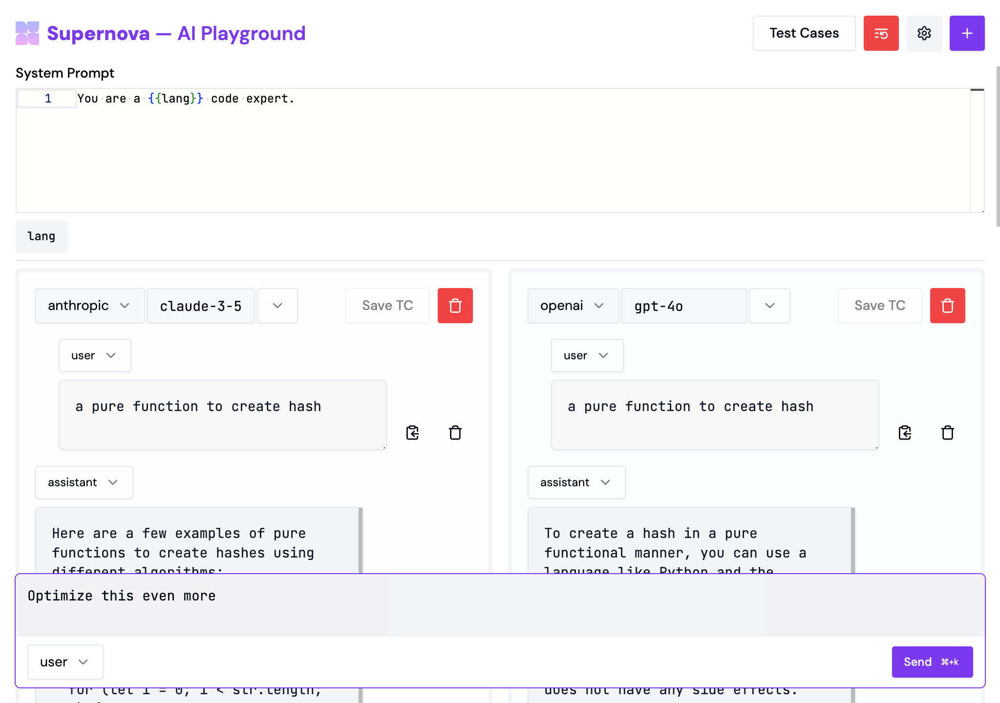

# [Supernova](https://www.getsupernova.ai) — AI Playground

Multi-model prompt evaluation tool used internally at Supernova AI. We built this to make our AI products better. Now we're open sourcing it.



## What it does

- Tests prompts across multiple AI models simultaneously (OpenAI, Anthropic, Azure, Google Generative AI, VertexAI, and more)
- Shows responses side-by-side for easy comparison
- Stores system prompts and variables separately
- Saves test cases for future testing
- Syncs message deletion across conversations

## Why we built this

We were spending too much time testing prompts one model at a time. This slowed down development of our AI tutor. So we built something to test faster.

The interface is intentionally simple. Enter a prompt once, see how different models respond. Save the good ones as test cases.

## Why Open Source?

We think more AI companies could benefit from faster prompt testing. And we want others to help make it better.

Running your own instance means full control over data and costs. You only pay for the API calls you make.

## Setup

1. Clone and install:
```bash
git clone https://github.com/supernova-app/ai-playground supernova-ai-playground
cd supernova-ai-playground
pnpm install
```

2. Set up environment:
```bash
cp .env.example .env
# Edit .env
```

3. Run migrations (mainly for the authentication):
```bash
pnpm db:generate
pnpm db:migrate
```

4. Start the server:
```bash
pnpm dev
```

## Tech Stack

- React + React Router
- TailwindCSS
- Vercel AI SDK
- Better Auth
- DrizzleORM (PostgreSQL)

## License

MIT
